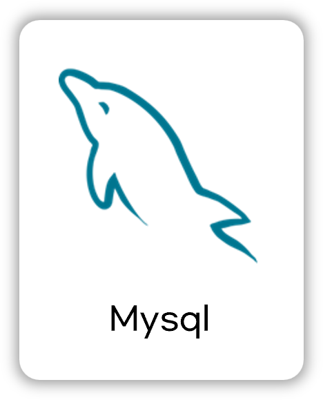
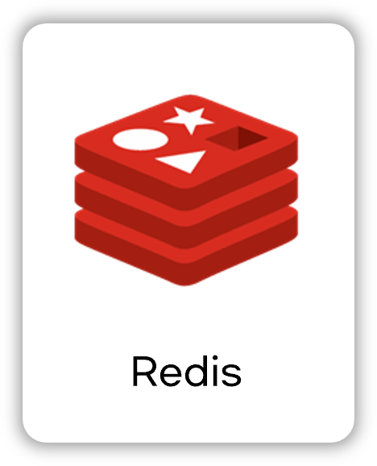

  
<!-- logo -->

   

# 우리가게 매출관리 Tally 프로젝트

<!--  -->

 

## 📝 소개
Tally는 소상공인을 위한 매출·지출 통합 관리 웹 서비스입니다. 
배달 플랫폼 수수료 반영, 연도별 / 월별 통계, 시각화, 사용자 친화적인 매장 관리 기능을 제공합니다. 
운영자가 편리하게 가게의 매출 / 지출 및 재무 현황을 파악할 수 있도록 도와줍니다.

## ✅ 주요 버전 정보

| 기술 스택           | 버전     |
|--------------------|----------|
| ☕ Java               | 17       |
| 🌱 Spring Boot        | 3.4.4    |
| 🔐 Spring Security    | 6.4.4    |
| 🗄️ Spring Data JPA    | 3.4.4    |
| 🐬 MySQL              | 8.4      |
| 📦 Redis              | 7.2      |
| ⚛ React              | 19       |

 

## ⚙ 기술 스택

### front-end

### Back-end

### Infra

### Tools

 

## 🌐 접속 링크
### 🔗 서비스 주소
- https://mytally.site
### 테스트 계정
- 이메일 : user@email.com 
 - 비밀번호 : password

 

## 🖼️  페이지
|로그인 페이지|회원 가입 페이지|
|:---:|:---:|
|||
|<b>대시보드 페이지 1</b>|<b>대시 보드 페이지 2</b>|
|||
|<b>기록 페이지</b>|<b>기록 제출 폼</b>|
|||
|<b>마이 페이지</b>|<b>마이 스토어 페이지</b>|
|||
|<b>스토어 상세 페이지</b>|<b>지원 페이지</b>|
|||

## 🗂️ APIs
작성한 API는 아래에서 확인할 수 있습니다.

👉🏻 https://mytally.site/api/docs

 

## 🛠️ 프로젝트 구조

- 본 프로젝트는 AWS EC2 인스턴스에서 구동되며, Docker를 활용하여 각 서비스를 컨테이너 단위로 관리하는 **마이크로서비스 아키텍처(MSA)** 를 구현하였습니다.
- 	외부에서 접근 가능한 포트는 **80(HTTP)** 과 **443(HTTPS)** 이며, 사용자는 기본적으로 80 포트로 접근 시 NGINX를 통해 자동으로 443 포트(HTTPS)로 리다이렉트됩니다.
- 	NGINX는 리버스 프록시로 작동하여, 프론트엔드(React)와 백엔드(Spring Boot) 서버의 내부 포트와 연결해줍니다.
- 	React는 내부적으로 3000 포트에서 실행되며, NGINX가 이 요청을 프록시합니다.
- 	Spring Boot 서버는 8080 포트에서 실행되며, NGINX가 API 요청을 해당 포트로 전달합니다.
- 	Spring 서버는 **Redis(6379 포트)** 를 JWT리프레쉬 토큰 저장/조회용으로 활용하며, **MySQL(3306 포트)** 과 연결되어 데이터베이스 처리를 담당합니다.
  
 

## 📋 프로젝트 제공 기능
### 👤 회원 기능
- 이메일 인증 기반 회원가입 및 로그인
- JWT + Refresh Token 기반 인증/인가
- Oauth 소셜 로그인 (Google, Naver, Kakao)
  

### 🏪 매장 관리
- 매장 생성/ 수정 / 삭제
- 매장별 매출·지출 분리 관리
  

### 💰 매출 / 지출 기록
- 주요 배달 플랫폼, 홀/포장 등 유형별 매출 등록
- 지출 유형, 결제 수단, 메모 등 상세 기록
  

### 📈 통계 및 대시보드
- 연도별/월별 매출·지출 통계
- 배달 플랫폼별 수수료 반영 여부 설정
- 순매출 계산 및 시각화 그래프 제공
  
### 🆘 지원 요청 기능
- 문의 폼 작성 시 서버에서 관리자에게 매일 자동 발송

 

## 🗺️  ERD

## 🧠 아티클
📦 [헥사고날 아키텍처, 내 프로젝트에 정말 필요했을까?](https://velog.io/@defender737/%ED%97%A5%EC%82%AC%EA%B3%A0%EB%82%A0-%EC%95%84%ED%82%A4%ED%85%8D%EC%B2%98-%EB%82%B4-%ED%94%84%EB%A1%9C%EC%A0%9D%ED%8A%B8%EC%97%90-%EC%A0%95%EB%A7%90-%ED%95%84%EC%9A%94%ED%96%88%EC%9D%84%EA%B9%8C)

🔐 [JWT 인증 방식 도입](https://velog.io/@defender737/JWT-%EC%9D%B8%EC%A6%9D-%EB%B0%A9%EC%8B%9D-%EB%8F%84%EC%9E%85)

📊 [통계 데이터를 어떻게 조회할까?](https://velog.io/@defender737/%ED%86%B5%EA%B3%84-%EB%8D%B0%EC%9D%B4%ED%84%B0%EB%A5%BC-%EC%96%B4%EB%96%BB%EA%B2%8C-%EC%A1%B0%ED%9A%8C%ED%95%A0%EA%B9%8C)

🌐 [리버스 프록시](https://velog.io/@defender737/%EB%A6%AC%EB%B2%84%EC%8A%A4-%ED%94%84%EB%A1%9D%EC%8B%9C)
